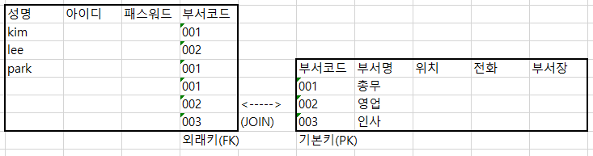

< 자주 확인해야 할 것>

```sql
desc <table>
```


# DBMS

> - 정형화된 데이터를 다룬다.
> - DB2, Oracle, MySQL, MSSQL, 티베로

## 1. 데이터베이스와 SQL

### 1. 데이터베이스란?

> - 대량의 정보를 컴퓨터가 다룰 수 있도록 가공 및 저장한 것
>
> - 대량의 데이터를 다수의 사용자가 접근할 수 있다.
>
> - DB를 관리하는 시스템을 DBMS라고 한다.
>
> - DBA
>
>   > - 다수의 사람이 데이터를 공유해야 함
>   > - 대량의 데이터를 다루기 어려운 형태
>   > - 프로그래밍과 연계가 쉬움
>   > - 안정성
>
> - DBMS의 종류
>
>   > 계층형, 관계형, 객체지향, XML
> >
>   > - 우리는 그중에서 관계형 데이터베이스를 사용할 것
>   

### 2. 데이터베이스 구성

> - 클라이언트 - 서버 - 
>   
> - 클라이언트가 꼭 end-device를 말하는 것은 아니다. 서버-DBMS관계에서는 서버가 클라이언트가 되기도 함
>   
> - 용어
>
>   - 셀
>   - 레코드
>   - 컬럼
>   - 테이블
>
> - 관계형 데이터베이스
>
>   - 중복되는 데이터를 최소화하기 위해서 연결하는 컬럼만 두고 테이블을 나눠관리 할 수 있다.
>
>     -> 테이블 정규화 
>
>     
>
>     
>
>     -> PK : unique 	=> 	Parent table
>
>     -> FK를 이용해서 PK테이블을 참조해 값을 가져온다.	=>	Child table

### 3. SQL 개요

> - 권한 : 
>
>   Role : 몇가지 권한을 묶어놓은 것.
>
> - 마지막에 (;)를 붙인다.
>
> - 키워드에 대소문자 구분이 없다.
>
> - 문자열은 'abc' 형태로 작은따옴표를 사용한다.
>
> - 상수는 기호없이 숫자만 사용한다. 

### 4. 테이블 작성

> - 컬럼명은 영어로 작성해야한다.
> - 데이터형과 열의 조건을 같이 사용할 수 있다.
>
> ```SQL
> CREATE DATABASE shop; // 데이터베이스 작성 shop 만 변수
> 
> CREATE TABLE goods
> (goods_id		char(4)			NOT NULL,
>  goods_name		VARCHAR(100)	NOT NULL,
>  goods_classify	VARCHAR(32)		NOT NULL,
>  sell_price		INTEGER			,
>  buy_price		INTEGER			,
>  register_date	DATE			,
>  PRIMARY KEY (goods_id));
> ```
>

### 5. 테이블 삭제와 변경

> - <u>**테이블을 삭제한 후에는 되돌릴 수 없다.**</u>
>
> ```sql
> DROP TABLE <테이블명>;
> ```
>
> - 테이블삭제와 마찬가지로 되돌릴 수 없다.
>
> ```sql
> ALTER TABLE <테이블명> ADD COLUMN <열 정의>;
> ALTER TABLE <테이블명> ADD COLUMN (<열 정의>, <열 정의>, ...);
> --<열 정의> => goods_name VARCHAR2(100);
> ALTER TABLE <테이블명> DROP COLUMN <열 정의>;
> ```
>
> - 기타
>
> ```sql
> ALTER TABLE <기존 테이블명> RENAME TO <새 테이블명>
> ```
>
> 


## 2. SELECT문

### 1. SELECT문의 기본

> ```sql
> SELECT 열이름, 열이름, 열이름
> 	FROM  테이블이름 ;
> 
> SELECT * FROM 테이블이름 ; // *는 모든 컬럼을 조회
> 
> SELECT goods_id AS id,		// 컬럼명 as명, 컬럼명 as as명, 컬럼명 "as명";
> 	goods_name AS name,		
> 	buy_prise AS price;		// AS는 열에 별명을 부여, 공백이 있는 경우 ""를 사용한다.
> 	FROM Goods;				// 조회할때만 별명으로 보인다.
> 
> ```
>
> - null도 입력할 수 있다. null은 0이나 space만 입력해 놓은 것과 다르다. 사용할 수 없고 저장되어 있지 않은 상태

### 2. 연산자

> - 여러 컬럼을 하나의 컬럼으로 조회할 수 있다. ||연산자 이용
> - 오라클의 문자열, 날짜 데이터는 ' '로 표현
>
> ```sql
> SELECT '나의 입사일은' || HIREADTE || '입니다.'
> 	FROM emp;
> ```
>
> - 연산의 결과로 컬럼을 생성할 수 있다. (+,-,*,/)
>
> ```sql
> SELECT ename, sal, comm, sal+comm 급여합
> 	FROM emp;
> ```
>
> ​		단, null이 포함되어 있는 컬럼은 연산할 수 없다.
>
> - 중복이 있는 경우 select문에 distinct를 추가할 수 있다.
>
> ```sql
> select [distinct] 컬럼명,  컬럼명, 컬럼명 as [alias명]
> 	from 테이블명
> 	where 조건;
> ```
>
> - where절은 조건식이 true가 되도록 정의
>
> - where절에 사용할 수 있는 비교연산자
>
>     =>, >, =<, < , =, <>, !=
>
> - where절에서 조건과 함께 비교해야 하는 값을 추가해야 하는 경우 문자, 날짜는 작은따옴표로 묶어줘야한다.
>
> - SQL은 대소문자를 구분하지 않는다. 값을 비교하는 경우 정확하게 대소문자까지 일치
>
> - 두 개 이상의 조건이 있는 경우 사용할 수 있는 연산자
>
>   - and연산자 : 모든 조건이 일치
>
>   - or연산자 : 모든 조건 중 한 개만 일치
>
>   - between A and B : and 연산과 동일
>
>      ​								=> 같은 컬럼에서 조건을 비교하는 경우
>
>   - in 연산자 : or 연산자의 의미와 동일
>
>     	컬럼명 in (비교할 값, 값)
>   
>     같은 컬럼에서 값을 여러개 비교해야 하는 경우
>   
>   - not 연산자 : 부정
>   
> - null에 비교연산자를 사용할 수 없다. (is null)을 사용한다.
>
> - like연산자 : 대표문자와 함께 사용
>
> ```sql
> 	where 컬럼명 like '값%' 	--값으로 시작하는 문자열
> 	where 컬럼명 like '%값'		--값으로 끝나는 문자열
> 	where 컬럼명 like '%값%'	--값이 들어가는 문자열
> 	where 컬럼명 like '_A___'	 --5글자중에 2번째 글자에 A가 들어가는 문자열
> ```

### 3. 데이터정렬

> - asc : 오름차순 정렬
> - desc : 내림차순 정렬
> - default는 오름차순
>
> ```sql
> SELECT 컬럼명, 컬럼명
> 	FROM 테이블명
> 	order by 컬럼명 asc;
> ```
>


## 3. 집약과 정렬

### 1. 집약해서 검색

> - COUNT, SUM, AVG, MAX, MIN
>
>   ```sql
>   SELECT COUNT(empno);
>   ```
>
>   count를 사용할 때는 null이 없는 컬럼을 사용해야한다. -> 기본키
>
>   불가능한 것은 아니고 공백을 제외하고 카운트해야한다면 사용할 수도 있다.
>
>   

### 2. 그룹화 : group by

> - 테이블에 저장된 레코드를 그룹화 하여 분류하고 싶은 경우 사용
>- SELECT 절에는 GROUP BY절에 명시한 컬럼명과 그룹함수만 사용할 수 있다.
> - 데이터가 복잡한 경우에는 GROUP BY절에 두 개 이상의 컬럼을 명시할 수 있다.
> - GROUP BY 하기 전에 적용해야 하는 조건은 WHERE절에 정의

### 3. HAVING

> - GROUP BY한 결과에 조건을 적용해야 하는 경우 HAVING절을 이용
>
> ```sql
> SELECT 컬럼
> FROM 테이블
>WHERE 조건
> GROUP BY 그룹화할 컬럼명(함수를 포함한 식도 가능)
>ORDER BY 정렬할 컬럼명
> 
>SELECT deptno, COUNT(empno)
> FROM emp
>GROUP BY deptno;
> HAVING 
> ```
> 

### 4. 정렬

> - order by를 이용한다.
> - 중첩할 수 있다.
>   - 앞에쓴 정렬문 먼저 수행한다.

## 4. 데이터 갱신

### 1. 등록

> ```sql
> create table member(
>         id varchar2(10),
>         pass varchar2(10),
>         addr varchar2(20));
>         
> insert into member values('jang','1234','서울');
> 
> insert all
>    into member values('lee','1235','부산')
>    into member values('kim','1236','대전')
>    into member values('hong','1237','수원')
> select * from dual;
> 
> insert into member values ('jjang',null,null);
> ```

### 2. 삭제

> ```sqlite
> delete member; -- member안의 모든 행을 삭제
> delete table member; -- member테이블 자체를 삭제
> 
> delete
> from member
> where addr = (select addr
>               from member
>               where id='jang');
> --'jang'의 addr을 조회해서 그것과 같은 값을 가진 행들을 모두 삭제한다.
> 
> -- rollback; 명령문으로 되돌릴 수 있다.
> ```

### 3. 갱신

> ```sql
> update member
> set addr=(select addr
>           from member
>           where id='jang')
> where id = 'lee';
> -- member테이블의 addr을 변경할것이고, lee의 addr을 jang의 addr로 변경한다.
> ```

## 5. 쿼리

### 1. 뷰

> - 물리적으로 저장되어있는 것이 아니라 실행결과를 보여주게 하는 가상의 테이블이다.
> - 시스템 계정에서 권한을 줘야 한다.
>
> ```sql
> SELECT deptno, avg(sal)
> FROM emp
> group by deptno;
> 
> CREATE VIEW countdata
> AS
> SELECT deptno, avg(sal) AS "empcount"
> FROM emp
> GROUP BY deptno;
> ```

### 2. 서브쿼리

> - 간단하게 1회용 뷰라고 볼 수 있다.
> - SELECT절, FROM절, WHERE절에서 모두 사용할 수 있다.
> - SQL문에 삽입된 query
> - 바깥쪽의 query를 main query, 안쪽에 삽입된 query를 sub query라고 한다.
> - 괄호로 묶어주어야 한다.
> - 메인쿼리가 실행되기 전에 한번 실행되며, 그 실행결과를 메인쿼리에서 사용한다.
>
> ```sql
> /* <스칼라 서브쿼리>
>  * 한개 값만 리턴되어야 한다.
>  * >, >=, <=, <와 같은 연산자만 사용할 수 있다.
>  */
> SELECT ename, sal
> FROM emp
> WHERE sal>(SELECT avg(sal)
> 			FROM emp
> 			WHERE deptno=10);
>  
>  /*	< 다중행 서브쿼리 >
>   * 서브쿼리의 실행결과가 열 하나의 행이 여러개인 경우
>   *	=연산자와 같은 연산자를 사용할 수 없다.
>   *	in, any, all을 사용할 수 있다.
>   	- in : 컬럼의 값이 정확하게 일치하는 경우
>   	- <any : 서브쿼리의 최대값보다 작다
>   	- >any : 서브쿼리의 최소값보다 크다
>   	- <all : 서브쿼리의 최소값보다 작다
>   	- >all : 서브쿼리의 최대값보다 크다
>   */
>   SELECT ename, sal
>   FROM emp
>   WHERE sal IN (SELECT 	sal
>                 FROM emp
>                 WHERE deptno = 10);  
>                 
> /*	< 다중컬럼 서브쿼리 >
>  * 두 개 이상의 컬럼과 다중행을 반환하는 서브쿼리
>  * 메인쿼리 비교 컬럼의 갯수, 종류가 서브쿼리의 반환 결과와 동일
>  */
>  WHERE(컬럼1,컬럼2) IN (SELECT 컬럼1,컬럼2
>  							.....		);
>  							
>  /* < 상관형서브쿼리(상호연관서브쿼리 >
>   * 메인쿼리의 값이 서브쿼리에서 사용되는 경우
>   * 메인쿼리 한 row에 대해 서브쿼리가 한 번씩 실행된다.
>   * [실행]
>   * 1. 메인쿼리에서 비교할 값을 가져온다.
>   * 2. 메인쿼리에서 받은 값을 이용해서 서브쿼리가 실행된다.
>   * 3. 서브쿼리의 실행결과로 메인쿼리가 실행된다.
>   * 4. 메인쿼리의 레코드수만큼 반복된다.
>   */
>   SELECT ename, dept, sal
>   FROM emp out
>   WHERE sal > (SELECT 	avg(sal)
>                 FROM emp e
>                 WHERE e.deptno = out.deptno);
>                 
> /* <FROM 절에서 사용하는 서브쿼리(inline view) >
>  * from절에서 서브쿼리를 추가해서 사용
>  * 서브쿼리 결과를 가상 테이블로 사용하겠다는 의미
>  * from절에 추가되는 서브쿼리는 alias를 정의해야한다.
>  * from절에 추가되는 서브쿼리 내부의 컬럼은 실제 컬럼처럼 메인쿼리에서 사용해야 하므로 컬럼도 컬럼명이 존재하거나 alias를 정의해야한다. -> join을 이용할 수 있게한다.
>  */
>  SELECT e.컬럼명1, a.컬럼
>  FROM 테이블명 e, (SELECT 컬럼
>        FROM 테이블명
>        WHERE ...) a
> ```
>
> 

## 6. 함수

### 1. 함수

>- 함수의 종류는 단일행함수, 그룹함수가 있다.
>
>- 단일행함수는 테이블의 모든 행에 각각 함수가 적용된다.
>
>- 그룹함수는 그룹함수를 그룹으로 묶인 데이터에 적용되므로 where절에 그룹함수를 사용할 수 없다.
>
> - 1) 단일행함수
>
>   -select, where, order by절에 모두 사용할 수 있다.
>
>   - 문자함수 
>
>     > - lower(문자열 or 컬럼명) : 값을 소문자로 변환
>     >
>     > - upper(문자열 or 컬럼명) : 값을 대문자로 변환
>     >
>     > - initcap(문자열 or 컬럼명) : 전달된 값의 첫 글자만 대문자로 변경
>     >
>     > - substr(문자열 or 컬럼명, 시작위치, 문자열의 갯수) : ex substr('ABCDE',2,2) => BC
>     >
>     > - length(문자열 or 컬럼명) : 글자수를 리턴, 한글도 한글자로 인식
>     >
>     > - instr(문자열 or 컬럼명, 찾을 문자, 찾을 위치, n번째 문자) : 특정 컬럼이나 문자열에서 문자의 위치를 찾을 때 사용한다.  ( 찾을 위치에 -1을 넣으면 뒤에서부터 찾는다.)
>     >
>     > - concat(문자열 or 컬러명, 문자열 or 컬럼명)
>     >
>     > - lpad(문자열 or 컬럼명, 출력할문자열의길이, 출력할 문자열) 전체 출력할 문자열의 길이에 문자열을 출력한 후 남는 공간에 정의한 문자를 채워 출력해주는 함수(왼쪽)
>     >
>     > - rpad(문자열 or 컬럼명, 출력할문자열의길이, 출력할 문자열) 전체 출력할 문자열의 길이에 문자열을 출력한 후 남는 공간에 정의한 문자를 채워 출력해주는 함수(오른쪽)
>     >
>     > - ltrim(문자열 or 컬럼명,문자) 컬럼에서 매개변수로 정의한 문자를 왼쪽에서 찾아 모두 제거
>     >
>     >   (연속된)
>     >
>     > - ltrim(문자열 or 컬럼명,문자) 컬럼에서 매개변수로 정의한 문자를 오른쪽에서 찾아 모두 제거
>     >
>     >   ```sql
>     >   SELECT LTRIM('aaaaaaaoracle','a') from dual;
>     >   -- oracle
>     >   ```
>
>   - 숫자함수
>
>     > - round(숫자, 반올림할 위치) : 위치까지 반올림,  일의자리는 0, -1을 입력하면 십의자리
>
>   - 변환함수
>
>     > - 데이터의 타입을 변환하기 위한 함수
>     >
>     > - 또 다른 함수의 매개변수로 사용하게 될 경우 타입이 컬럼의 타입과 일치해야 하므로 
>     >
>     > - cast(값 or 컬럼 as 타입)
>     >
>     >   ​								날짜 : Date
>     >
>     >   ​								숫자 : Interger
>     >
>     > - to_char(값 or 컬럼, 표시할 format)
>     >
>     >   ** 숫자를 문자로 변환
>     >
>     >   ** 숫자의 한 자리를 표시 => 9, 0
>     >
>     >   ** 콤마 => ,
>     >
>     >   ** 소수점 => .
>     >
>     >   ** 통화기호 => \, $, L(지역의 통화를 출력)
>     >
>     >   ** 날짜를 문자열로 변환 : 년 월 일 
>     >
>     >   ​		년도 => YYYY
>     >
>     >   ​		월 	=> MM
>     >
>     >   ​		일 	=> DD
>
>   - 날짜함수
>
>     > - sysdate : 시스템시간
>     > - select sysdate-5, sysdate, sysdate+5 from dual;
>
>   - null처리함수
>
>     > - nvl(컬럼, null인 경우 처리할 식이나 값)
>     >
>     > - nvl2(컬럼, 표현값1, 표현값2)
>     >
>     >   ​				null이 아닌경우, null인경우
>
> - 2) 그룹함수
>
>   - group by를 적용한 후에 사용할 함수
>   - sum, avg, max, min, 


## 7. join

### 1. inner join

(두 테이블에서 정확하게 일치하는 컬럼에 대한 데이터만 조회)

> - 정규화된 테이블이나 혹은 일반적으로 작성된 여러 테이블의 컬럼을 이용해서 데이터를 조회하는 것을 join이라고 한다.
> - join은 관계형 DB에서 반드시 알아야 하는 개념
> - 기본키(PK), 외래키(FK)의 관계를 이용해서 테이블을 join => 외래키를 가지고 기본키 테이블에서 값을 비교하여 작업이 진행된다.
> - join을 하는 경우 무조건 where 절에 join 조건을 정의해야 한다.
> - 테이블을 여러 개 사용하는 경우 모든 테이블들의 join 조건을 정의해야 하며, select절에서 사용하지 않고 조건으로만 사용한다고 하더라도 join조건은 정의해야 한다.
>
> ```sql
> /*	컬럼명 앞에 '테이블명.'을 표시해주는 것이 일반적이다. 
>  *	from절에 테이블명을 정의할 때  alias를 함께 추가하여 alias를 통해 엑세스 하면 편하다.
>  *	where절에는 반드시 join조건을 추가하며, join조건에는 두 테이블의 값을 비교하기 위해 정의하는 것이므로 외래키와 기본키를 정의한다.	
>  *	외래키테이블(child테이블)에 정의된 컬럼값을 기본키테이블(parent테이블)에서 비교하여 정확하게 일치하는 경우 값을 가져온다.
>  */
> select d.dname, e.ename, sal
> from emp e, dept d
> where e.deptno = d.deptno and sal>=3000;
> ```
>
> - PK는 unique해야한다.

### 2. outer join

(두 개 이상의 테이블에 조인을 적용했을 때 join조건을 만족하지 않아도 데이터를 조회하고 싶은 경우 사용)

> - join 조건에 (+)를 추가한다.
>
>   => 데이터가 확장되어야 하는 곳
>
> - join조건을 만족하지 않아도 한 쪽 테이블의 모든 데이터를 출력하고 싶을 때 사용하는 조인방식으로 정보가 부족한 테이블의 컬럼에 (+)를 붙인다.
>
> ```sql
> SELECT 테이블 alias.컬럼명
> from 테이블 alias
> where 테이블alias.컬럼명(+) = 테이블alias.컬럼명
> 
> ```

### 3. self join

(두 개 이상의 테이블에서 조인하지 않고 같은 테이블의 칼럼을 이용해서 조인 - 하나를 가상테이블로 설정)

> - from에서 두번 불러준다.
>
> ```sql
> SELECT 테이블 alias.컬럼명
> from 테이블 alias1, 테이블 alias2
> where 테이블alias1.컬럼명(+) = 테이블alias2.컬럼명
> ```
>
> 


